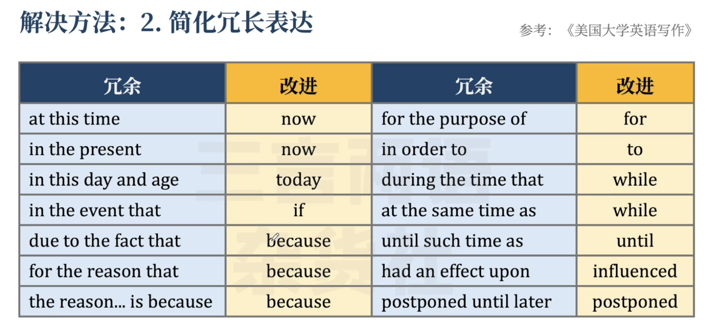
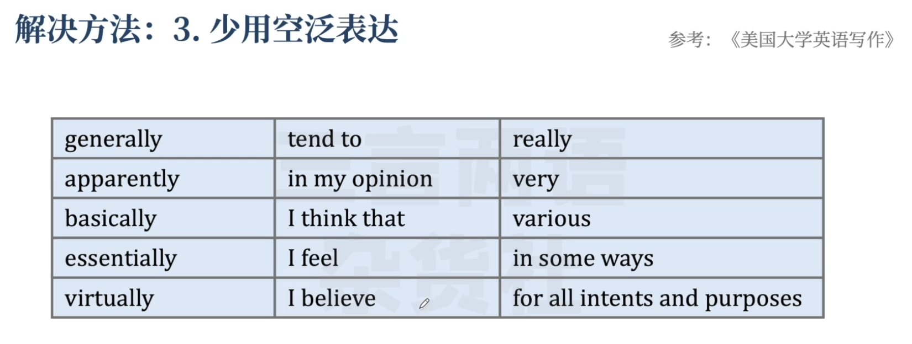
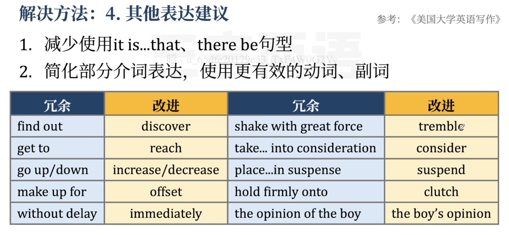
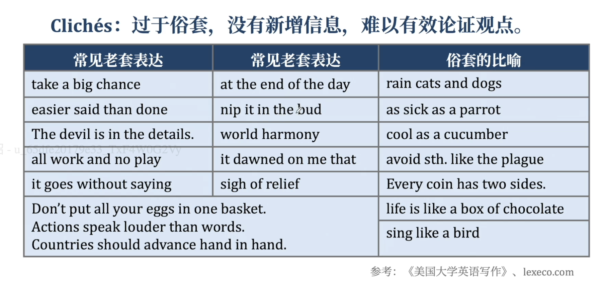
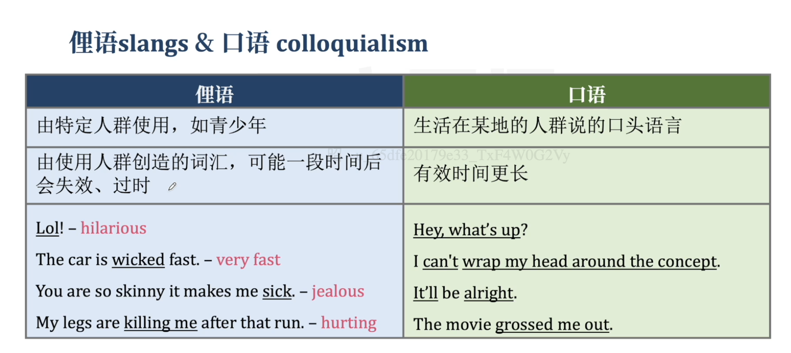
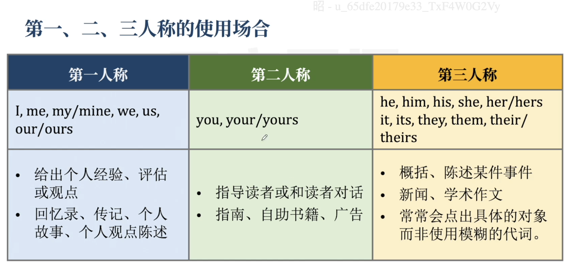

#  How to Write a Sentence

> 句子是英语写作的基础，写出含义清晰、表达简练、语法正确、正式规范的句子

### 1. 如何让句子更清晰

#### 1.1 给出具体内容

**办法：**

1. **避免单独使用意义宽泛、没有具体含义的词。**

**the idea, the meaning, the cont nt, some factors, in many ways, different perspectives, various reasons, different things......**

2. **写出这些词具体包含什么内容/方面。**

   

~ 例句：The meaning of the book is not clear the first time you read it,but after several reading,the meaning comes through.

修改成：The book’s idea  about school safety is not clear when you read for the first time ，the meaning comes through. 

> 如果是用的是“read it at first time”行不行？“at first time”是不正确的表达，应该是“for the first time”，用于表示“第一次”

#### 1.2 补充具体信息

**办法：**

1. **给出具体名称**

**The girl has bought a car. → Emily has bought an Audi**

2. **使用具体的动词、词组**

**He got it. → He found a solution.**

3. **在名词前补充形容词**

**A man opened the box. → A tall man in blue opened the dusty wooden box.**

~ 例句：My roomate is truly horrible.

修改成：My inconsiderate roommate leaves his clothes everywhere,play loud music,and smell terrible.

#### 1.3 避免一概而论

**办法：**

1. **避免「一杆子打翻一船人」**
   **反间自己：我说的事情100%会发生吗？**
2. **避免绝对化用词（特 情况除外）**
    **all, every, everyone, no one, only, always, never, impossible, must.**
3. **补充严谨的修饰语**
    **it is widely accepted/believed that, tend to, usually, often**
    **加上限定的修饰成分**

~ 例句：As we all know ,drinking green tea is good for our health

修改成：It is widely believed that drinking tea may aid weight and digestion

> 如果“aid weight”表达不够准确。那就使用“aid in weight loss”或“aid weight reduction”

#### 1.4 保证主语明确

**突出句子重心，关注真正的主角。**

**主动句vs主动句：意义清晰（谁-做了-什么事），避免句子冗长复杂。**

1. **Papers need to be bought to teach the students to paint.**

​	The Art Department needs to buy papers to teach students painting.    

2. **The entrance exam is failed by over one-third of the applicants to the school.**
    Over one-third of the applicants to the school failed the entrance exam.

3. **By then, the article will have been completely revised by the**

**主动句vs被动句**

4. **动作发出者不确定或不重要：**

**Every year, thousands of people are diagnosed as having cancer.**

**5． 营造权威语调：**

**Visitors are not allowed after 9:00 p.m.**

## 2. 如何让句子简明、专业

#### 2.1 使用简明表达

**办法：思考一个表达是否有必要**

1. 是否是语法的必需成分。

2. 是否构成核心思想、事实、情感或细节描述

#### 2.2 避免乱用定从

****

#### 2.3避免陈词滥调

Cliches：过于俗套，没有新增信息，难以有效论证观点。

cliche n.陈词滥调、老套《朗文词典》

> an idea or phrase that has been used so much that it is not effective or does not have any meaning any longer

一个被用得太多以至于没有效果或不再具有任何意义的想法或短语

**解决方法：**

1. **cliches一般由母语使用者界定，可避开已知的坑；**
2. **修改cliches：**

## 2.4避免俚语口语

**解决方法：**

1. **将口语用词替换成更具体的正式用词主动避开已知口语俚语表达。**
2. **勤查词典，判断正式/非正式用词。**
    **留意formal/informal 标记，留意使用场合。**
3. **时刻确保读者看得懂。**
    **主动详细解释逻辑， 避免使用俏皮俚语**

#### 2.5人称使用规范

**第一人称使用要点：**

- **在正式文体中，只适用于给出个人观点或陈述个人经历。**

- **除以上情况，尽量避免使用第一人称。滥用第一人称会使论述不够权威、客观。**

- **I think, I believe, I am writing about, In the paragraph before**
   **where lsaid.， in my opinion,as far aslam concerned等主观表达**

  

**第二人称使用要点：**

**为保证专业、正式、客观，学术作文一般不使用第二人称。**

**you容易指代不清，需要明确讨论对象，转为第三人称**

**第三人称使用要点：**

**形式包括：名称（Tom）、名词 （teachers, doctors）、代词 （he/she, they）、其他（one, everyone, anyone）**

第三人称使用要点：

注意性别，避免刻板印象

注意单复数

#### 2.6 总结

| 总结 |
| :--- |
|   1. 使用简洁表达：去除重复、冗长、空泛表达，大道至简。   |
|    2. 避免滥用定从：句子主角决定句式，使用多种定语形式。   |
|   3.避免陈词滥调：做最有创意的作者，拒绝老套。    |
|   4. 避免俚语口语：正式场合，正经说话，照顾读者。   |
| 5. 人称使用规范：多用三，少用一，不用二。 |
