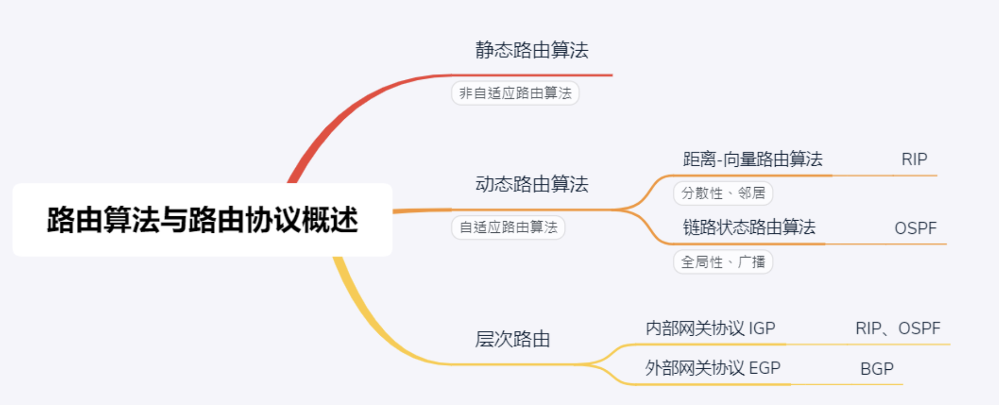

## 重点大题

#### OSPF的原理

网络中的路由器各自建立描述网络结构的OFPF链路状态数据库，然后每一个路由器根据数据库，按照链路权值的大小，以自身为根建立起最短路径树，查找最短路径树，获取最短路径，建立起路由表。然后广播整个自治域。

#### OSPF 和 RIP 的区别

**从选路佳，收敛快，占用资源少来看**

* OSPF因为是链路状态型协议，所以计算出的路径不会出现环路，并且，OSPF以带宽作为开销值进行选路，相较于跳数更加合理。

* 由于OSPF的计时器时间短于RIP的计时器时间。

* 从单个数据包携带的数据量来看，因为OSPF携带的拓扑信息(LSA)，所以数据量较RIP大很多。但是由于RIP存在30S一次的周期更新，而OSPF不存在，并且OSPF本身存在很多减少更新量的措施、。

#### **EBGP 和 IBGP的作用**

* IBGP的主要作用是实现AS内部的路由传播和一致性，确保AS内部的所有路由器都具有相同的全局路由表。通过iBGP，AS内部的路由器可以了解到来自其他AS的路由信息，并将其传递给其他AS内的路由器，以实现全局路由的可达性。（需要注意的是，iBGP只负责在AS内部传递外部路由信息，而不负责内部路由的学习和传播。内部路由通常使用其他内部路由协议（如OSPF、IS-IS等）来实现）

* EBGP的主要作用是实现不同AS之间的路由传播和互连。当两个AS之间建立EBGP对等连接后，它们可以交换路由信息，并根据各自的路由策略选择最佳路径。EBGP通过传递路由信息，使得互联网中的不同AS能够相互通信和交换数据。（需要注意的是，EBGP只负责在不同AS之间传递路由信息，而不负责内部路由的学习和传播。每个AS内部的路由选择通常由iBGP和其他内部路由协议（如OSPF、IS-IS等）来实现。）

#### traceroute 命令原理

traceroute 程序基于 ICMP 回显请求（Echo Reguest）、回显应答（Echo Reply）和超时（TTL-exceeded）来現，完全基ICMP、因而也可筒称 ICMP traceroute。

* 首先源主机发出 ICMP Echo Request，第一次 Echo request 的TTL 设置1，第二次 Echo request 的 TTL 设置2，依次递增，直至第30次，实际程序中每次一般会发出多个（常常是3个）Echo request 报文来避免网络传输带来的偶然错误。

* 中间的路由器对收到的ICMP 报文中IP 首部的TTL执行递减操作，如果 TTL值为0或1，就对源主机送回 ICMP TTL 超时报文（TTL-exceeded,ICMP 类型为11），ICMP请求报文同时因 TTL超时而被丢弃。

* 源主机依次收到中间路由器发回的 ICMP TTL-exceeded 差错报文，由此知晓去往目的地所经过的每个路由器。

* 最后的ICMP Echo Request 报文到达目标节点时，送回ICMP Echo Reply，源主机收到这个 Echo Reply 报文便知道已经完成了路径探索，就不再发送 TTL 增加的EchoRequest 报文而是结束程序

#### NAT作用

NAT是内外网IP地址互换的一种协议，作用就是可以将内部地址转换成公有地址进行访问互联网，然后再将外网IP地址转换成[内网](https://so.csdn.net/so/search?q=内网&spm=1001.2101.3001.7020)IP地址进行读取，可以多个内部地址用两个公有地址进行访问。

#### 路由算法与路由协议概述

**三次握手**

- **第一次握手**：
  客户端将TCP报文**标志位SYN置为1**，随机产生一个序号值seq=J，保存在TCP首部的序列号(Sequence Number)字段里，指明客户端打算连接的服务器的端口，并将该数据包发送给服务器端，发送完毕后，客户端进入`SYN_SENT`状态，等待服务器端确认。 

- **第二次握手**：
  服务器端收到数据包后由标志位SYN=1知道客户端请求建立连接，服务器端将TCP报文**标志位SYN和ACK都置为1**，ack=J+1，随机产生一个序号值seq=K，并将该数据包发送给客户端以确认连接请求，服务器端进入`SYN_RCVD`状态。 

- **第三次握手**：
  客户端收到确认后，检查ack是否为J+1，ACK是否为1，如果正确则将标志位ACK置为1，ack=K+1，并将该数据包发送给服务器端，服务器端检查ack是否为K+1，ACK是否为1，如果正确则连接建立成功，客户端和服务器端进入`ESTABLISHED`状态，完成三次握手，随后客户端与服务器端之间可以开始传输数据了。 

  

  >  注意:我们上面写的ack和ACK，不是同一个概念：
  >
  >  - 小写的ack代表的是头部的确认号Acknowledge number， 缩写ack，是对上一个包的序号进行确认的号，ack=seq+1。 
  >  - 大写的ACK，则是我们上面说的TCP首部的标志位，用于标志的TCP包是否对上一个包进行了确认操作，如果确认了，则把ACK标志位设置成1。 

#### **协议分析的作用**

协议分析也称为网络分析，是指通过捕获在网络信息通信中传递的数据，搜集网络统计信息，讲数据包解码为可以阅读的形式过程。

* 协议分析器常于诊断网络出现的故障
* 也可以用来测试网络。通常如一下两种：
  * 主动向网络中的数据包来测试
  * 监听不同的通信的被动方式来测试
* 协议分析器还可以用于搜集网络性能的趋势数据，从而为预防出现影响网络正常工作或性能的极端情况提供参考
* 有利于学习网络原理的同学

#### 了解ARP欺骗在当前网络攻击中的主要形式，以及防范方法？

* 中间人攻击（MITM）
  中间人攻击就是攻击者在目标主机与另一方主机（可以是网关或服务器）进行正常通信的过程中，进行拦截、插入、伪造、中断数据包，达到截获对方敏感数据，伪造身份等目的。
* 拒绝服务攻击（Dos）
  拒绝服务攻击以阻塞正常网络带宽、耗尽服务器内存资源、干扰及破坏正常通信为主。在传统的网络中，Dos攻击已成为攻击者进行恶意破坏大型网站通信、破坏公司网络等极具威胁性的途径。
* mac泛洪
  交换机依靠对CAM表的查询来确定正确的转发端口。攻击者通过伪造大量的arp应答报文，使CAM表被这些伪造的mac地址占据，真实的mac地址却无法进入CAM表，当CAM表记录的mac地址达到上限后，新的条目将不会添加到CAM表中。此时，任何一个经过交换机的正常单播数据帧，都会以广播帧的形式类处理，导致网络带宽资源被大量的数据包占用。

* 手动检测方法 使用arp-a命令，查看主机的arp缓存表状态
