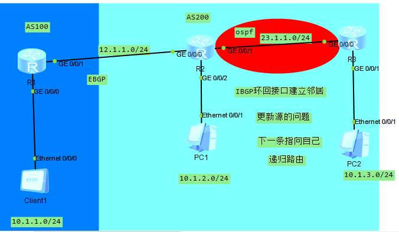

## BGP配置



**各个端口ip地址配置略**

#### R1

```
int lo 0
ip add 1.1.1.1 32
BGP 100
router-id 1.1.1.1
PEER 12.1.1.2 as-number 200
net 10.1.1.0 24
```

#### R2

```
int lo 0
ip add 2.2.2.2 32
bgp 200
router-id 2.2.2.2
perr 12.1.1.1 as-number 100
net 10.1.2.0 24
peer 3.3.3.3 as-unmber 200
perr 3.3.3.3 conect-interface lo 0
perr 3.3.3.3 next-hop-local 
ospf 10
area 0
net 23.1.1.0 0.0.0.255
net 10.1.2.0 0.0.0.255

```

R3

```
int lo 0
ip add 3.3.3.3 32
bgp 200
perr 2.2.2.2 as-number 200
perr 2.2.2.2 conect-interface lo 0
net 10.1.3.0 24
ospf 10 are 0
net 23.1.1.0 0.0.0.255
net 10.1.3.0 0.0.0.255
```


