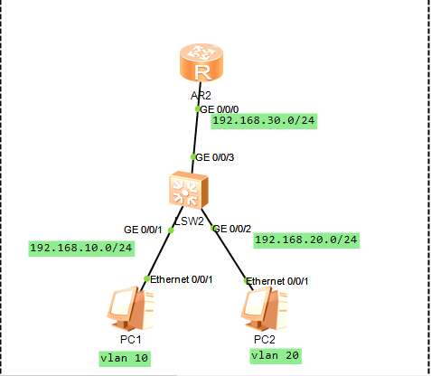

## 二层交换机与路由器




### sw

#### vlan 划分

```
vlan batch 10 20 30

int g0/0/1

port link-ty acc

po de vlan 10

int g0/0/2

port link-ty acc

po de vlan 20

int g0/0/3

port link-ty acc

po de vlan 30

int vlan 10

ip add 192.168.10.254 mask 24

int vlan 20

ip add 192.168.20.254 24

int vlan 30

ip add 192.168.30.1 24
```


#### rip

```
rip 100

undo su

ver 2

net 192.168.30.0 

net 192.168.10.0

net 192.168.20.0
```


#### dhcp

```
dhcp en

int vlan 10 

net 192.168.10.0 mask 24

g 192.168.10.254

lease day 1

int vlan 20 

net 192.168.20.0 mask 24

g 192.168.20.254

lease day 1

int vlan 10

dh select gobal

int vlan 20

dh select gobal
```


### router

```
int g0/0/1

ip add 192.168.30.1 24
```


#### rip

```
rip 100

undo su

ver 2

net 192.168.30.0 
```


