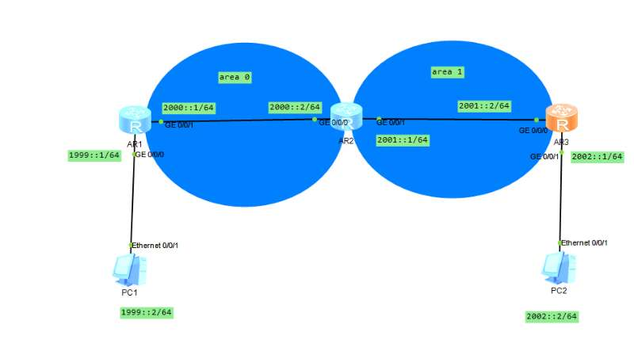

## OSPFV3



### AR1

```
ipv6

ospfv3 2

router-id 1.1.1.1

import-route  direct

int g0/0/1

ipv en

ipv add 1999::1/64

osp

int g0/0/1

ipv en

ipv add 2000:1/64

ospfv 2 area 0
```


AR2

```
ipv6

ospfv3 2

router-id 2.2.2.2

int g0/0/0

ipv en

ipv add 2000::2/64

ospfv 2 area 0
int g0/0/1

ipv en

ipv add 2001:1/64

ospfv 2 area 1
```


AR3


```
ipv6

ospfv3 2

router-id 3.3.3.3

import-route  direct

int g0/0/0

ipv en

ipv add 2001::2/64

ospfv 2 area 1

int g0/0/1

ipv en

ipv add 2002:1/64
```

