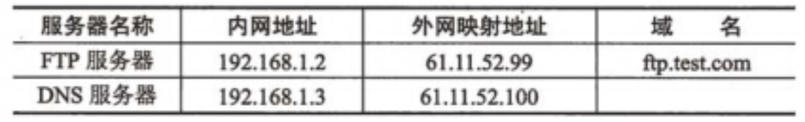

## 网络初级复习

#### 选择

* 在Linux操作系统中，目录etc/dev主要用于存放（    ）。

**A.设备文件**     B.配置文件      C.命令文件       D.进程和系统信息

 

* 在Linux 中，用户 tom在登录状态下，键入cd命令并按下回车键后，该用户进入的目录是（    ）。

A./root      B./home/root     C./root/tom       **D./home/tom**

 

* 要刷新Windows 2008系统的 DNS解析器缓存，以下命令正确的是（    ）。

A. ipconfig/cleardns         B. ifconfig/cleardns

**C. ipconfig/flushdns**         D. ifconfig/flushdns

 

* 在HTML中，为图像logo-jpg建立到www.abc.com 的超链接。可使用（    ）。

A.<a href src="logo-.jpg"></img>

B.<a img=“www.abc.com"><href sec=“logo.jpg'></a>

**C.**

D.<a href="logo.jpg'><"img src"="www.abc.com'></a>

 

* 下列描述中，属于DoS攻击的是（    ）。

A.为Wi-Fi设置连接口令，拒绝用户访问

B.设置访问列表以拒绝指定用户访问

**C.攻击者发送大量的非法请求，造成服务器拒绝正常用户的访问**

D.为用户设定相应访问权限

 

* 使用Sniffer可以接收和截获信息，在非授权的情况下这种行为属于（    ）。

A. **网络监听**    B.DoS攻击       C.木马攻击       D.ARP攻击

 

* 以太帧中，采用的差错检测方法是.（    ）。

A.海明码      **B.CRC**        C.FEC        D. 曼彻斯特码 

 

* 下面给出的网络地址中，属于私网地址的是（    ）。

A.128.12.73.214  B.192.32.146.23   C.172.34.21.18    **D.10.25.34.124**

 

* 按照域名系统的定义，域名www.sales.microsoft.com包含4个标识符，（    ）是注册给组织或个人的二级域名。

A. www       B. sales      **C. microsoft**       D.com

 

* 以下存储器中，需要周期性刷新的是（    ）。

**A. DRAM**      B.SRAM         C.FLASH        D.EEPROM

 

* 以下关于CPU的叙述中，正确的是（    ）。

A.CPU中的运算单元、控制单元和寄存器组通过系统总线连接

**B.在CPU中，获取指令并进行分析是控制单元的任务**

C.执行并行计算任务的CPU必须是多核的

D.单核CPU不支持多任务操作系统而多核CPU支持

 

* 在Excel 中，设单元格F1 的值为56.323，若在单元格F2中输入公式“=TEXT(F1,"￥0.00")”，则单元格F2的值为（    ）。

A. ￥56     B.￥56.323      **C.￥56.32**      D.￥56.00

 

* 以下文件格式中，（    ）属于声音文件格式。

A.XLS      B.AVI       **C. WAV**      D.GIF

 

* （    ）图像通过使用色彩查找表来获得图像颜色。

A．真彩色    **B.伪彩色**      C.黑白       D.矢量

 

* 传输经过SSL加密的网页所采用的协议是（    ）。

A. http    B. https        **C. s-http**      D.http-s

 

* 使用Ping命令对地址10.10.10.59发送20次请求，以下命令正确的是（    ）。

A.ping-t 20 10.10.10.59         **B. ping-n 20 10.10.10.59**

C.ping-1 20 10.10.10.59         D.ping-c 20 10.10.10.59

 

 

* 如果要使得用C语言编写的程序在计算机上运行,则对其源程序需要依次进行（    ）等阶段的处理。

A.预处理、汇编和编译          B.编译、链接和汇编

**C.预处理、编译和链接**          D.编译、预处理和链接

* 使用的目的主机IP地址为（    ）。

A.0.0.0.0      **B.127.0.0.1**     C.10.0.0.1      D.210.225.21.225

 

* IPv6的地址长度为（    ）比特。

A.32        B.48         C.64         **D.128**

 

* 因特网中的域名系统(Domain Name System)是一个分层的域名树，在根域下面是顶级 域。下面的项级域中属于国家顶级域的是（    ）。

A.COM        B.EDU        C.NET         **D.UK**

 

* IPv6地址FFO5::B3的完整形式是（    ）。

A.FF05:0000:B300           B.FF05:0:0:0:0:0:0:B300

C.FF05:0000:00B3           **D.FF05:0:0:0:0:0:0:00B3**

 

* 交换机配置命令 sysname switchl 的作用是（    ）。

A.进入系统视图   **B. 修改设备名称**  C. 创建管理VLAN     D. 配置认证方式

 

* SMTP 使用的传输层协议是（    ）。

**A.TCP**       B.IP        C.UDP          D.ARP 

 

* 以太网交换机采用级联模式互连时，下层交换机的（    ）连接上层交换机的以太端口。

**A.Uplink端口用直通线**         B.Uplink端口用交叉线

C.以太端口用直通线           D.以太端口用交叉线

 

 

* 在获取与处理音频信号的过程中，正确的处理顺序是（    ）。

**A.采样、量化、编码、存储、解码、D/A变换**

B.量化、采样、编码、存储、解码、A/D变换

C.编码、采样、量化、存储、解码、A/D变换

D.采样、编码、存储、解码、量化、D/A变换

 

* 下列地址属于私网地址的是（    ）。

**A.10.255.0.1**    B.192.169.1.1    C.172.33.25.21    D.224.2.1.1

 

 

* 配置某网络交换机时，由用户视图切换至系统视图，使用的命令是（    ）。

**A. system-view**  B.vlanif      C.acl          D.display 

 

* 结构化综合布线系统中的建筑群子系统是指 （    ）。

A. 管理楼层内各种设备的子系统     **B. 连接各个建筑物的子系统**

C. 工作区信息插座之间的线缆子系统   D. 实现楼层设备间连接的子系统

 

* 配置交换机时，以太网交换机的Console端口连接（    ）。

A.广域网      B．以太网卡     **C.计算机串口**      D.路由器S0口

 

* 在Linux中，设备文件存放在（    ）目录中。

**A./dev**      B./home       C./var         D./sbin

 

* 在Linux中，解析主机域名的文件是（    ）

A.etc/hosts    **B.etc/host.conf**   C.etc/hostname     D.etc/bind

 

* HTML语言中，可使用表单的（    ）属性限制用户输入的字符数量。

A. Text      B.size       C.value       **D. maxlength**

* 某PC出现网络故障，一般应首先检查（    ）。

A.DNS服务器    B.路由配置       C．系统病毒      **D.物理连通性**

 

* 以下关于海明码的叙述中，正确的是（    ）。

A.校验位随机分布在数据位中        B.所有数据位之后紧跟所有校验位

C.所有校验位之后紧跟所有数据位     **D.每个数据位由确定位置关系的校验位来校验**

 

* 在Excel中，设单元格F1的值为38，若在单元格F2中输入公式“=IF(AND(38<F1，F1<100),“输入正确”,“输入错误”)”，则单元格F2显示的内容为（    ）。

A.输入正确     **B.输入错误**       C.TRUE       D.FALSE

 

在 Windows系统中，系统对用户组默认权限由高到低的顺序是（    ）。

A.everyone→administrators→power users→users

**B. administrators→power users→users→everyone**

C. power users→users→everyone→administrators

D.users→everyone→administrators→power users

 

 

* UTM(统一威胁管理)安全网关通常集成防火墙、病毒防护、入侵防护、VPN等功能模块，（    ）功能模块通过匹配入侵活动的特征，实时阻断入侵攻击。

A.防火墙    B.病毒防护      **C.入侵防护**     D.VPN

 

* 通常测试网络连通性采用的命令是（    ）。

A. Netstat   **B. ping**        C. msconfig     D.cmd

 

* 下面的网络管理功能中，不属于性能管理的是（    ）。

A.收集统计信息              B.维护并检查系统状态日志

**C.跟踪、辨认错误**             D.确定自然和人工状况下系统的性能

 

* 在Windows系统中，如果希望某用户对系统具有完全控制权限，则应该将该用户添加到用户组（    ）中。

A. Everyone   B. users       C.power users    **D. administrators**

 

#### 填空

8个64 kbps 的信道通过统计时分复用到一条主干线路，如果该线路的利用率为80%，则其带宽应该是  640  kbps。

某计算机采用48×48数字化点阵字模表示一个汉字，字模中的每一个点在存储器中用一个二进制位存储。那么，现有1024个汉字需要在计算机中存储，则要求的存储空间应为288K字节。

DHCP客户机首次启动时需发送报文请求分配IP地址，该报文源主机地址为  0.0.0.0    。

将二进制序列1011011 表示为十六进制是  5B   。   

汉字机内码与国标码的关系为机内码=国标码＋8080H。若已知某汉字的国标码为3456H，则其机内码为  B4D6H   。

使用图像扫描仪以300DPI的分辨率扫描一幅3×3英寸的图片，可以得到  900*900    像素的数字图像。

A发给B一个经过签名的文件，B可以通过  A的公钥   来验证该文件来源的真实性。  

计算机系统中，虚拟存储体系由  主存一辅存   两级存储器构成。 

.在HTML页面中，要使用提交按钮，应将type属性设置为  submit  。 

某种部件使用在10000台计算机中，运行工作1000小时后，其中20台计算机的这种部件失效，则该部件千小时可靠度R为  0.998   。

 

#### 名词解释

.ICMP                   网间控制报文协议；因特网信报控制协议

.graphical user interface            网图界面

.IP security protocol              安全协议

Virtual Private Network            虚拟专用网

network architect               网络结构

.loopback address               回送地址；环回地址；本机回送地址

.Layer 2 Tunneling Protocol           第二层隧道协议

.Point-To- Point Tunneling Protocol       点到点隧道协议

packet-filteting firewall            包过滤防火墙

.time division multiplexing           时分复用

.Simple Network Management Protocol      简单网络管理协议

Open shortest path first            开放式最短路径优先

Stealth virus                隐藏式病毒

Traffic monitoring              流量监测

Trojan horse                木马

 

#### **计算题**

 

* 在异步通信中，每个字符包含1位起始位、8位数据位和2位终止位，若数据速率为 1kb/s, 则传送大小为2000 字节的文件花费的总时间为  (  ) 秒。

**每个字符传送需发送：1+8+2=11bit,  因此2000个字节的文件共需要传送；** 

**2000×11=22000bit。 总时间为：22000/1kbps=22s。**

* 设用户U 有2000台主机，则必须给他分配  ?  个C 类网络

**用户U 有2000台主机，则必须给他分配8个C 类网络(254×8=2032)**

 

* 用户U 有4000台主机，分配给他16个C 类网络。则该用户的地址掩码为( )

 

**用户U 有4000台主机，分配给16个C 类网络，所以子网掩码占用了20位，即[255.255.240.0](https://255.255.240.0/)。**

 

#### 简答题

**公司为保护内网安全，采用防火墙接入Internet,网络结构如图4-1所示。**  

 

 问题：防火墙支持三种工作模式：透明网桥模式、路由模式和混杂模式。在（1）模式下，防火墙各个网口设备的IP地址都位于不同的网段。

路由模式

问题：E1 E2 E3 分别是属于什么区域

非信任区 信任区 DMZ区  

 问题：为了支持NAT，防火墙采用混杂模式（E2与E1之间，E2与E3之间采用路由模式，E3与E1之间采用透明网桥模式，请为防火墙的接口El、E2、E3配置合适的IP地址和子网掩码（表4-1）。
 

第一个空 210.156.169.6

> 通过子网掩码判断主机为3位，所以7个主机号，1，2，3，4，5都被用了所以只有

第二空 192.168.1.1 / 192.168.1.3 - 192.168.1.15

> 同理

第三空  255.255.255.248

问题：4.3  完成防火墙的别名表（表4-2）和E2端口的过滤规则表（表4-3），使内网PC能正常访问WWW服务和Telnet服务。
 

210.156.169.3

80

> 别名值都要知道

**某单位通过路由器实现NAT转换，网络拓扑结构如下图所示。其中所有服务器和客户机都使用私网地址，FTP服务器可对外提供服务。**

**路由器NAT映射地址及对应域名如下表所示。**

某单位通过路由器实现NAT转换，网络拓扑结构如下图所示。其中所有服务器和客户机都使用私网地址，FTP服务器可对外提供服务。

路由器NAT映射地址及对应域名如下表所示。

 

该网络中，区域1 是防火墙的　（1）　。为使该企业网能够接入Internet，路由器的接口1可以使用的IP地址是（2）　。
备选答案：

（1）A．DMZ  B．Trust区域  C．Untrust区域
（2）A．10.1.1.1  B．61.11.52.10  C．172.30.1.1 D．192.168.1.1

 **答案：（1）A 或 DMZ （2）B 或 61.11.52.101** 

若需要架设一台Web服务器对外提供服务，域名为[www.test.com](http://www.test.com/)，外网IP地址为61.11.52.98，内网IP地址为192.168.1.4，则Web 服务器应该放置在　（3）　。若内网用户可以通过域名正常访问该Web服务器，而外网用户无法访问该服务器。经检查，Web服务器的DNS记录配置正确，则可能的原因是　（4）　。
备选答案：
（3）A．区域1             B．区域2
（4）A．路由器上NAT 表项配置错误    B．DHCP服务器配置错误 C．Web 服务器未启动

**答案：（3）A 或 区域1 （4）A 或 路由器上NAT 表项配置错误**

　　若区域2中的计算机接入Internet 时，网络连接时断时续，网络管理员利用Sniffer抓包工具分析区域2 中的分组，发现大量arp 应答数据包占用了网络带宽，则可能的故障原因是　（5）　。为了排除故障，网络管理员应采取的措施为　（6）　。
（5）备选答案：
 A．网络线路出现故障  B．网络中出现了arp病毒
 C．DNS服务器配置错误  D．防火墙配置错误

 **答案：（5）B 或网络中出现了arp病毒**

 **（6）查出受病毒感染的机器，将其从网络中断开,杀毒**

　　若某客户机使用IE 可以正常访问网站，而QQ 软件不能联网，可能的原因是　（8）　。
 （8）备选答案：
 A．DNS服务器配置错误  B．QQ软件代理配置错误
 C．客户端机器网络线路故障 D．客户端机器网卡故障
 **答案：B 或 QQ软件代理配置错误**